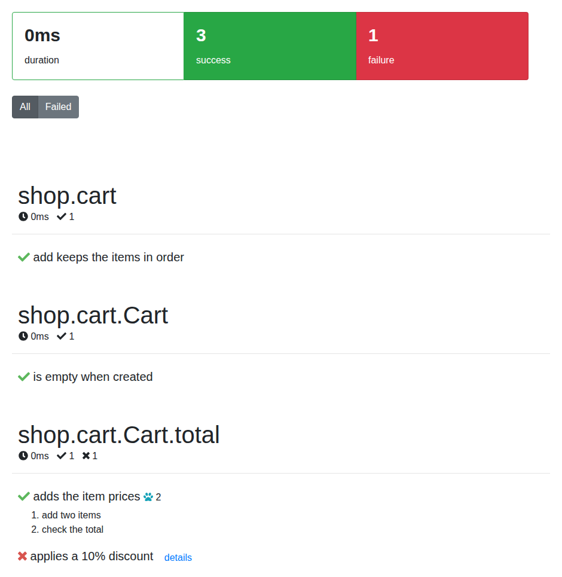

# Reporters

[up](../README.md)

Here is what each reporter prints, and how you can create your own.

## Summary

  - [About](#about)
  - [Spec](#spec)
  - [Spec steps](#spec-steps)
  - [Dot matrix](#dot-matrix)
  - [Landing](#landing)
  - [List](#list)
  - [Progress](#progress)
  - [Result](#result)
  - [TAP](#tap)
  - [HTML](#html)
  - [Allure](#allure)
  - [XUnit](#xunit)
  - [Stats](#stats)
  - [Spec progress](#spec-progress)
  - [Agent](#agent)
  - [Extending](#extending)

## About

A reporter presents the result of a test run. Most of the time the reader is a person, but it can be an IDE or a CI
server too. Trial comes with console reporters, which print while the tests run, and file reporters, which write to the
`artifactsLocation` folder (`.trial` by default).

Choose the reporters in the `reporters` list of your `trial.json`:

```json
{
  "reporters": ["spec", "result", "stats", "html"]
}
```

You can also replace the list for one run with `-r`, for example `dub test -- -r spec,result`. See
[Command line](command-line.md).

All the samples below come from the same run: a `shop.cart` module with one `unittest` block and a `Cart` spec suite.
The "adds the item prices" test has two [steps](steps.md), and "applies a 10% discount" fails:

```d
private alias suite = Spec!({
  describe("Cart", {
    it("is empty when created", { ... });

    describe("total", {
      it("adds the item prices", {
        Cart cart;
        {
          auto step = Step("add two items");
          cart.add(10);
          cart.add(15);
        }
        {
          auto step = Step("check the total");
          cart.total.should.equal(25);
        }
      });

      it("applies a 10% discount", {
        Cart cart;
        cart.add(50);
        cart.totalWithDiscount(10).should.equal(40);
      });
    });
  });
});

/// add keeps the items in order
unittest { ... }
```

## Spec

This is the default reporter. It prints the tests nested the same way as the modules and suites. Failed tests get a
number that matches the details printed by the [result](#result) reporter.

Use `spec`.

```text
  shop
    cart
      ✓ add keeps the items in order

      Cart
        ✓ is empty when created

        total
          ✓ adds the item prices
          0) applies a 10% discount
```

## Spec steps

A flavour of the spec reporter that also prints the [steps](steps.md) of each test.

Use `spec-steps`.

```text
  shop
    cart
      ┌ add keeps the items in order
      └ ✓ Success

      Cart
        ┌ is empty when created
        └ ✓ Success

        total
          ┌ adds the item prices
          │   add two items
          │   check the total
          └ ✓ Success
          ┌ applies a 10% discount
          └ 0) Failure
```

## Dot Matrix

One character for each test: a `.` when it passes and a red `!` when it fails. Good if you prefer minimal output.

Use `dot-matrix`.

```text
...!
```

## Landing

A gimmick: a plane lands on a runway while the tests run. The plane turns red when a test fails.

Use `landing`. When the run ends, the runway looks like this:

```text
━━━━━━━━━━━━━━━━━━━━━━━━━━━━━━━━━━━━━━━━━━━━━━━━━━━━━━━━━━━━
⋅⋅⋅⋅⋅⋅⋅⋅⋅⋅⋅⋅⋅⋅⋅⋅⋅⋅⋅⋅⋅⋅⋅⋅⋅⋅⋅⋅⋅⋅⋅⋅⋅⋅⋅⋅⋅⋅⋅⋅⋅⋅⋅⋅⋅⋅⋅⋅⋅⋅⋅⋅⋅⋅⋅⋅⋅⋅⋅⋅✈
━━━━━━━━━━━━━━━━━━━━━━━━━━━━━━━━━━━━━━━━━━━━━━━━━━━━━━━━━━━━
```

## List

A flat list with the full name of every test, printed as each one passes or fails.

Use `list`.

```text
  ✓ shop.cart add keeps the items in order
  ✓ shop.cart.Cart is empty when created
  ✓ shop.cart.Cart.total adds the item prices
  0) shop.cart.Cart.total applies a 10% discount
```

## Progress

A progress bar with the number of finished tests. It turns red when a test fails.

Use `progress`. When the run ends, it shows:

```text
4/4 ▓▓▓▓
```

## Result

Prints the details of every failed test, then a summary of the run. It is part of the default list, and you need it
to see why a test failed.

Use `result`.

```text
0) shop.cart.Cart.total applies a 10% discount:
fluentasserts.core.base.TestException@source/shop/cart.d(53): FAIL: 45 should equal 40. | actual=45 expected=40 | source/shop/cart.d:53

----------------
source/shop/cart.d:53 void shop.cart.__lambda_L28_C31().__lambda_L29_C22().__lambda_L34_C25().__lambda_L50_C38() [0x551db6]
...

Executed 4 (1 failed) tests in 3 suites in 7 ms, 978 μs, and 9 hnsecs.
```

## TAP

Prints the results for a [Test Anything Protocol](https://en.wikipedia.org/wiki/Test_Anything_Protocol) consumer.

Use `tap`.

```text
TAP version 13
1..4
ok - shop.cart.add keeps the items in order
ok - shop.cart.Cart.is empty when created
ok - shop.cart.Cart.total.adds the item prices
not ok - shop.cart.Cart.total.applies a 10% discount
# FAIL: 45 should equal 40. | actual=45 expected=40 | source/shop/cart.d:53
#
  ---
  message: 'FAIL: 45 should equal 40. | actual=45 expected=40 | source/shop/cart.d:53'
  severity: failure
  location:
    fileName: 'source/shop/cart.d'
    line: 53
```

## HTML

Writes `result.html`, a page with the duration, the number of passed and failed tests, and every suite with its tests
and steps. The "Failed" button hides the tests that passed, and "details" opens the failure. Publish it with your CI
artifacts to have a report for each build.

Use `html`.



## Allure

Writes one xml file per suite to the `allure` folder, in the format that the [Allure](https://allurereport.org/)
command line turns into an html report. Steps are kept as Allure steps.

Use `allure`. Part of the file for the `shop.cart.Cart.total` suite:

```xml
<ns2:test-suite start="1791110623829" stop="1791110623829" version="1.5.2" xmlns:ns2="urn:model.allure.qatools.yandex.ru">
    <name>shop.cart.Cart.total</name>
    <title>shop.cart.Cart.total</title>
    <test-cases>
        <test-case start="1791110623829" stop="1791110623829" status="passed">
            <name>adds the item prices</name>
            <steps>
                <step start="1791110623829" stop="1791110623829" status="passed">
                  <name>add two items</name>
                </step>
                <step start="1791110623829" stop="1791110623829" status="passed">
                  <name>check the total</name>
                </step>
            </steps>
        </test-case>
        <test-case start="1791110623829" stop="1791110623829" status="failed">
            <name>applies a 10% discount</name>
            <failure>
                <message>FAIL: 45 should equal 40. | actual=45 expected=40 | source/shop/cart.d:53</message>
                ...
```

To turn the files into an html report:

```bash
allure generate -o allure-html .trial/allure
```

## XUnit

Writes one JUnit xml file per suite to the `xunit` folder. Most CI servers read this format; in GitLab add
`.trial/xunit/*.xml` to `artifacts:reports:junit`.

Use `xunit`. The file for the `shop.cart.Cart.total` suite:

```xml
<?xml version="1.0" encoding="UTF-8"?>
<testsuites>
  <testsuite name="shop.cart.Cart.total" errors="0" skipped="0" tests="2" failures="1" time="0" timestamp="2026-10-04T12:43:43.8297456">
      <testcase name="adds the item prices">
      </testcase>
      <testcase name="applies a 10% discount">
      <failure message="FAIL: 45 should equal 40. | actual=45 expected=40 | source/shop/cart.d:53">fluentasserts.core.base.TestException@source/shop/cart.d(53): ...</failure>
      </testcase>
  </testsuite>
</testsuites>
```

## Stats

Writes `stats.csv` with the start time, end time and status of every suite, test and step, and the file and line of
each test. The [spec progress](#spec-progress) reporter reads it on the next run to estimate how long the tests take.

Use `stats`.

```text
shop.cart.add keeps the items in order,2026-10-04T12:43:43.8297084,2026-10-04T12:43:43.8297097,success,source/shop/cart.d,61
shop.cart,2026-10-04T12:43:43.8297061,2026-10-04T12:43:43.8297112,unknown,,0
shop.cart.Cart.is empty when created,2026-10-04T12:43:43.8297117,2026-10-04T12:43:43.8297446,success,source/shop/cart.d,30
shop.cart.Cart,2026-10-04T12:43:43.8297115,2026-10-04T12:43:43.8297455,unknown,,0
shop.cart.Cart.total.adds the item prices.add two items,2026-10-04T12:43:43.8297462,2026-10-04T12:43:43.82975,unknown,,0
shop.cart.Cart.total.adds the item prices.check the total,2026-10-04T12:43:43.8297505,2026-10-04T12:43:43.8297578,unknown,,0
shop.cart.Cart.total.adds the item prices,2026-10-04T12:43:43.8297458,2026-10-04T12:43:43.8297586,success,source/shop/cart.d,35
shop.cart.Cart.total.applies a 10% discount,2026-10-04T12:43:43.8297594,2026-10-04T12:43:43.8298288,failure,source/shop/cart.d,50
shop.cart.Cart.total,2026-10-04T12:43:43.8297456,2026-10-04T12:43:43.8298293,unknown,,0
```

## Spec progress

An experimental reporter that extends the spec reporter with the running time of the current suite and test, and the
time left until the run ends. It is meant for slow tests, like UI tests written with `selenium` or `appium`, together
with the [parallel executor](executors.md) and the [stats](#stats) reporter.

Use `spec-progress`. Part of the output:

```text
*[0s]shop.cart.Cart.total *[0s]adds the item prices

        total
          ✓ adds the item prices
```

## Agent

A plain text reporter for AI coding agents. It prints nothing for the tests that pass. For each failed test it prints the
test name, where the test and the failure are, the failure message, and the `-f` filter that runs that test again. The
run ends with one summary line.

Use `agent`.

```text
FAIL shop.cart.Cart.total applies a 10% discount
  test: source/shop/cart.d:50
  at: source/shop/cart.d:53
  FAIL: 45 should equal 40. | actual=45 expected=40 | source/shop/cart.d:53
  rerun: -f "=shop.cart.Cart.total applies a 10% discount"

RESULT failed=1 passed=3 pending=0 skipped=0
```

It is enabled automatically when an agent runs the tests. See [Agent mode](command-line.md#agent-mode).

## Extending

If you want to write a custom reporter, have a look at the Lifecycle interface that trial provides and implement the methods that you need.

[Interfaces list](http://trial.szabobogdan.com/api/trial/interfaces.html)

If you want to use your custom reporter, you can add it to the `LifeCycleListeners`:

```d
static this() {
    LifeCycleListeners.instance.add(new MyCustomReporter);
}
```
